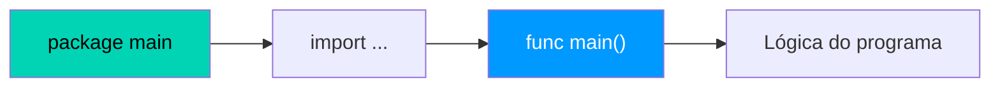

# 📝 Sintaxe Básica e Variáveis

Go tem sintaxe limpa e minimalista — sem ponto e vírgula obrigatório, chaves sempre exigidas, e tipagem estática com inferência de tipos.

---

## Estrutura de um Arquivo Go



---

## Declaração de Variáveis

```go 
package main

import "fmt"

func main() {
    var nome string = "Gopher" // (1)!
    var ativo = true           // (2)!
    preco := 29.99             // (3)!

    var ( // (4)!
        cidade  string = "São Paulo"
        versao  int    = 22
        estavel bool   = true
    )

    fmt.Println(nome, ativo, preco, cidade, versao, estavel)
}
```

1. 📌 Declaração **explícita** — especifica tipo e valor.
2. 🔍 Declaração com **inferência de tipo** — Go deduz que é `bool`.
3. ⚡ Forma **curta** com `:=` — a mais usada dentro de funções.
4. 📦 **Bloco `var`** — agrupa múltiplas declarações de forma organizada.

!!! warning "Atenção — Escopo do `:=`"
    O operador `:=` **só funciona dentro de funções**. Para variáveis no nível do pacote (globais), use obrigatoriamente `var`.

---

## Tipos Primitivos

| Tipo | Tamanho | Faixa / Uso |
|------|---------|-------------|
| `int` | 32/64 bits | Inteiros (depende da plataforma) |
| `int8` / `int16` / `int32` / `int64` | fixo | Inteiros de tamanho específico |
| `float32` / `float64` | 32/64 bits | Números decimais |
| `string` | UTF-8 | Sequência de bytes imutável |
| `bool` | 1 bit | `true` ou `false` |
| `rune` | 32 bits | Caractere Unicode (alias de `int32`) |
| `byte` | 8 bits | Byte (alias de `uint8`) |

!!! info "Zero Values"
    Em Go, toda variável declarada sem inicialização recebe um **valor zero** automaticamente: `0` para números, `""` para strings, `false` para booleans e `nil` para ponteiros, slices e maps.

---

## Constantes e `iota`

```go 
const Pi = 3.14159 // (1)!

const (
    Domingo = iota // (2)!
    Segunda        // (3)!
    Terça
    Quarta
    Quinta
    Sexta
    Sábado
)

fmt.Println(Segunda) // 1
fmt.Println(Sexta)   // 5
```

1. 🔒 Constante simples — valor imutável definido em tempo de compilação.
2. 🔢 `iota` começa em **0** e incrementa a cada constante no bloco.
3. ↗️ Cada linha seguinte recebe o próximo valor automaticamente.

!!! tip "Dica — iota como enumeração"
    O `iota` é a forma idiomática de criar **enumerações** em Go, já que a linguagem não possui a keyword `enum` nativa.

---

## Conversão de Tipos

```go 
var inteiro int = 42
var flutuante float64 = float64(inteiro) // (1)!
var intNovo int = int(flutuante)         // (2)!

import "strconv"
texto := strconv.Itoa(42)               // (3)!
numero, err := strconv.Atoi("123")      // (4)!
```

1. 🔄 Conversão `int` → `float64` — sempre explícita em Go.
2. ✂️ Conversão `float64` → `int` — **trunca** o decimal, não arredonda.
3. 🔤 Converte inteiro para string usando o pacote `strconv`.
4. 🔢 Converte string para inteiro — retorna também um `error` caso falhe.

!!! danger "Cuidado — Truncamento silencioso"
    Converter `float64` para `int` **descarta a parte decimal sem arredondar**:
    ```go
    int(3.99) // resultado: 3, não 4!
    int(9.9)  // resultado: 9, não 10!
    ```

---

## Formatação com `fmt.Printf`

```go 
nome := "Gopher"
idade := 5
versao := 1.22
ativo := true

fmt.Printf("Nome:   %s\n", nome)   // (1)!
fmt.Printf("Idade:  %d anos\n", idade) // (2)!
fmt.Printf("Versão: %.2f\n", versao)   // (3)!
fmt.Printf("Tipo:   %T\n", ativo)      // (4)!
```

1. `%s` → formata como **string**.
2. `%d` → formata como **inteiro decimal**.
3. `%.2f` → formata como **float com 2 casas decimais**.
4. `%T` → exibe o **tipo** da variável, não o valor.

| Verbo | Uso |
|-------|-----|
| `%v` | Valor padrão |
| `%T` | Tipo da variável |
| `%d` | Inteiro decimal |
| `%f` / `%.2f` | Float |
| `%s` | String |
| `%t` | Boolean |
| `%b` | Binário |
| `%x` | Hexadecimal |
