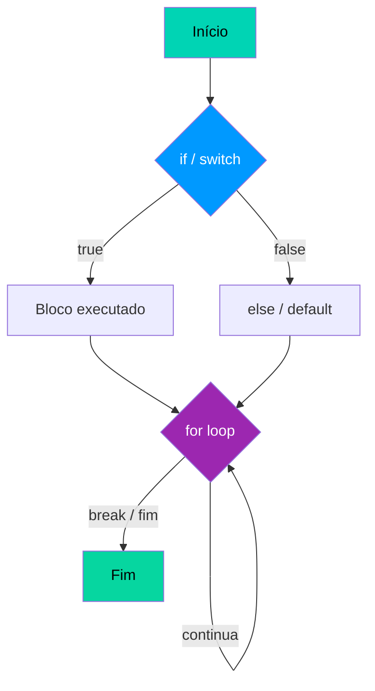
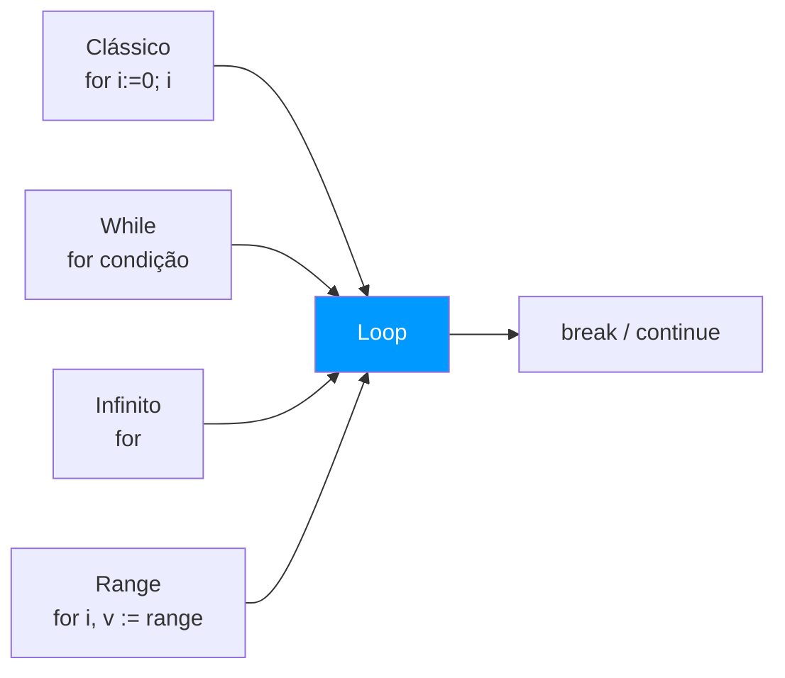

# 🔀 Estruturas de Controle

Go possui apenas três estruturas de controle: `if`, `for` e `switch`. Não existe `while` — o `for` cobre todos os casos de repetição.

---

## Fluxo de Controle



---

## `if` / `else if` / `else`

```go 
temperatura := 28

if temperatura > 35 { // (1)!
    fmt.Println("Muito quente!")
} else if temperatura > 25 { // (2)!
    fmt.Println("Agradável.")
} else {
    fmt.Println("Frio!")
}
```

1. 🚫 Sem parênteses ao redor da condição — diferente de C e Java.
2. 🔗 O `else if` encadeia condições em sequência.

!!! warning "Atenção — Chaves obrigatórias"
    Em Go, as **chaves `{}` são sempre obrigatórias**, mesmo em blocos de uma única linha. Não é possível omiti-las como em C ou JavaScript.

### `if` com instrução de inicialização

```go 
if numero, err := strconv.Atoi("42"); err == nil { // (1)!
    fmt.Printf("Número: %d\n", numero)
} else {
    fmt.Println("Erro:", err)
}
// numero e err NÃO existem aqui fora (2)!
```

1. ⚡ A variável `numero` é declarada **dentro do if** e existe apenas naquele bloco.
2. 🔒 O escopo fica limitado ao bloco — não "vaza" para fora.

!!! tip "Dica — Padrão idiomático"
    Declarar variáveis dentro do `if` é muito comum em Go para tratar erros sem poluir o escopo externo.

---

## `for` — O único loop



### Clássico

```go 
for i := 0; i < 5; i++ { // (1)!
    fmt.Println(i)
}
```

1. 🔢 Três partes: **inicialização** `;` **condição** `;` **pós-iteração** — separadas por `;`.

### Como `while`

```go 
contador := 1
for contador <= 10 { // (1)!
    fmt.Println(contador)
    contador++
}
```

1. 🔄 Omitindo inicialização e pós-iteração, o `for` se comporta como um `while`.

### `for range` — iterando coleções

```go 
frutas := []string{"maçã", "banana", "laranja"}

for i, fruta := range frutas { // (1)!
    fmt.Printf("[%d] %s\n", i, fruta)
}

for _, fruta := range frutas { // (2)!
    fmt.Println(fruta)
}
```

1. 📋 `range` retorna dois valores: **índice** e **elemento**.
2. 🗑️ Use `_` para descartar o índice quando não precisar dele.

!!! tip "Dica — range em Maps e Strings"
    O `for range` também funciona em **maps** (retorna chave e valor) e **strings** (retorna índice e `rune`).

### `break` e `continue`

```go 
for i := 0; i < 10; i++ {
    if i == 3 {
        continue // (1)!
    }
    if i == 7 {
        break // (2)!
    }
    fmt.Println(i)
}
// Saída: 0 1 2 4 5 6
```

1. ⏭️ `continue` pula para a **próxima iteração** sem sair do loop.
2. 🛑 `break` **sai do loop** completamente.

---

## `switch`

```go 
nota := 85

switch { // (1)!
case nota >= 90:
    fmt.Println("A — Excelente")
case nota >= 80: // (2)!
    fmt.Println("B — Bom")
case nota >= 70:
    fmt.Println("C — Regular")
default: // (3)!
    fmt.Println("D — Insuficiente")
}
```

1. 🎯 `switch` sem expressão funciona como um `if-else` encadeado.
2. ✅ Não precisa de `break` entre os cases — o Go **para automaticamente** após o match.
3. 🔁 O `default` é executado quando **nenhum case** corresponde.

!!! info "Diferença do C/Java"
    Em Go, o `switch` **não faz fallthrough por padrão**. Para forçar a execução do próximo case, use explicitamente a keyword `fallthrough`.

!!! warning "Atenção — `fallthrough` incondicional"
    O `fallthrough` em Go é **sempre executado**, sem verificar a condição do próximo case. Use com muito cuidado.

### Type Switch — verificando tipos

```go 
func verificarTipo(v interface{}) {
    switch tipo := v.(type) { // (1)!
    case int:
        fmt.Printf("Inteiro: %d\n", tipo)
    case string:
        fmt.Printf("String: %s\n", tipo)
    case bool:
        fmt.Printf("Boolean: %t\n", tipo)
    default:
        fmt.Printf("Outro tipo: %T\n", tipo)
    }
}
```

1. 🔍 A sintaxe `v.(type)` é exclusiva do **type switch** — inspeciona o tipo dinâmico de uma interface.

---

## FizzBuzz — Exemplo Completo

```go 
package main

import "fmt"

func main() {
    for i := 1; i <= 30; i++ { // (1)!
        switch {
        case i%15 == 0: // (2)!
            fmt.Println("FizzBuzz")
        case i%3 == 0:
            fmt.Println("Fizz")
        case i%5 == 0:
            fmt.Println("Buzz")
        default:
            fmt.Println(i)
        }
    }
}
```

1. 🔢 Itera de 1 a 30 usando `for` clássico.
2. ➗ Testa divisibilidade por 15 primeiro (múltiplo de 3 E de 5) para evitar falsos positivos.
