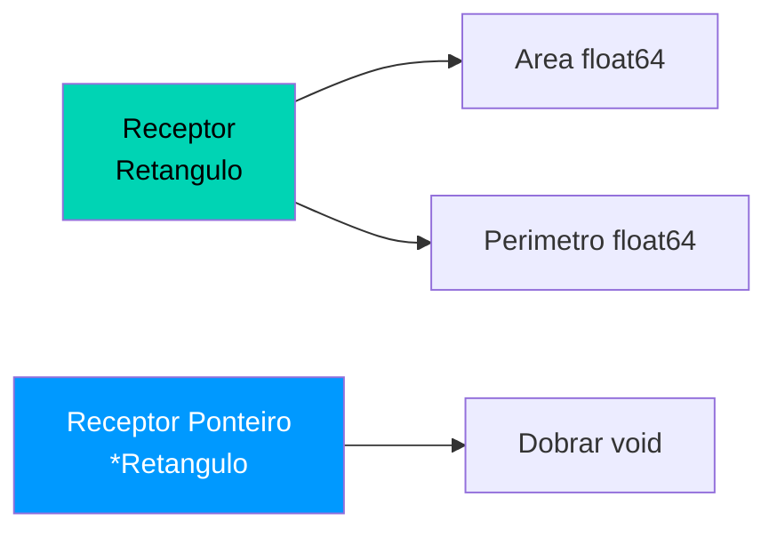

# 🏗️ Structs e Métodos

Go não tem classes. Usa **structs** para agrupar dados e **métodos** para associar comportamentos — favorecendo composição em vez de herança.

---

## OOP tradicional vs Go

```mermaid
graph LR
    subgraph OOP Tradicional
        CL[Classe] --> HER[Herança]
        HER --> SUB[Subclasse]
    end
    subgraph Go
        ST[struct] --> EMB[Embedding]
        EMB --> COM[Composição]
        ST --> INT[interface]
    end

    style OOP Tradicional fill:#1a1d2b,stroke:#ff6b6b
    style Go fill:#1a1d2b,stroke:#00d4b4
```



---

## Structs

```go 
type Pessoa struct { // (1)!
    Nome  string // (2)!
    Idade int
    Email string
}

p := Pessoa{ // (3)!
    Nome:  "Alice",
    Idade: 30,
    Email: "alice@email.com",
}

fmt.Println(p.Nome)       // Alice (4)!
p.Email = "novo@email.com" // modificando
```

1. 🏗️ `type NomeStruct struct` define um novo tipo de dado composto.
2. 🔤 Campos que começam com **maiúscula** são exportados (públicos fora do pacote).
3. ✍️ Instanciação por **nome de campo** — forma mais segura e legível.
4. 📌 Acesso via **ponto** — igual a outras linguagens.

!!! tip "Dica — Zero Values em Structs"
    Campos não inicializados recebem zero values automaticamente: `""` para string, `0` para int, `false` para bool.

---

## Métodos



```go 
type Retangulo struct {
    Largura float64
    Altura  float64
}

func (r Retangulo) Area() float64 { // (1)!
    return r.Largura * r.Altura
}

func (r *Retangulo) Dobrar() { // (2)!
    r.Largura *= 2
    r.Altura *= 2
}

ret := Retangulo{Largura: 5, Altura: 3}
fmt.Println(ret.Area()) // 15
ret.Dobrar()
fmt.Println(ret.Area()) // 60 (3)!
```

1. 📖 **Receptor por valor** — recebe uma cópia. Não modifica o original. Ideal para leituras.
2. ✏️ **Receptor por ponteiro** — recebe a referência. Modifica o original. Necessário para mutações.
3. ✅ Após `Dobrar()`, a largura virou 10 e a altura virou 6 → Área = 60.

!!! warning "Atenção — Quando usar ponteiro no receptor"
    Use `*T` (ponteiro) quando:

    - O método precisa **modificar** o receptor
    - A struct é **grande** (evitar cópia cara)
    - **Consistência** — se um método usa ponteiro, todos devem usar

---

## Interfaces

```go 
type Forma interface { // (1)!
    Area() float64
    Perimetro() float64
}

type Circulo struct { Raio float64 }

func (c Circulo) Area() float64 { // (2)!
    return 3.14159 * c.Raio * c.Raio
}
func (c Circulo) Perimetro() float64 {
    return 2 * 3.14159 * c.Raio
}

func imprimirForma(f Forma) { // (3)!
    fmt.Printf("Área: %.2f\n", f.Area())
}

imprimirForma(Circulo{Raio: 5})    // ✅
imprimirForma(Retangulo{4, 6})     // ✅ (4)!
```

1. 📋 Interface define um **contrato de comportamento** — lista de métodos que um tipo deve ter.
2. 🔄 `Circulo` implementa `Forma` **implicitamente** — sem `implements`. Basta ter os métodos.
3. 🎭 **Polimorfismo** — a função aceita qualquer tipo que satisfaça a interface.
4. ✅ `Retangulo` já implementa `Forma` pois tem `Area()` e `Perimetro()`.

!!! info "Implementação implícita"
    Em Go, **não existe** `implements`. Um tipo satisfaz uma interface automaticamente ao ter todos os métodos exigidos por ela. Isso permite desacoplamento total entre pacotes.

---

## Embedding — Composição

```go
type Animal struct {
    Nome string
}

func (a Animal) Respirar() {
    fmt.Println(a.Nome, "respirando...")
}

type Cachorro struct {
    Animal       // (1)!
    Raca string
}

d := Cachorro{
    Animal: Animal{Nome: "Rex"},
    Raca:   "Labrador",
}

fmt.Println(d.Nome) // Rex (2)!
d.Respirar()        // Rex respirando... (3)!
```

1. 🔗 **Embedding** — embed de `Animal` sem nomear o campo. Os campos e métodos são "promovidos".
2. ⬆️ Campo `Nome` de `Animal` fica acessível diretamente em `Cachorro`.
3. ⬆️ Método `Respirar()` de `Animal` também é promovido.

---

## Comparação OOP vs Go

| Conceito OOP | Equivalente em Go |
|-------------|-------------------|
| Classe | `struct` + métodos |
| Herança | Embedding (composição) |
| Interface | `interface` (implícita) |
| Construtor | Função `New...` por convenção |
| `this` / `self` | Receptor do método |
| `public` / `private` | Maiúscula / minúscula |
| Polimorfismo | Interfaces |
