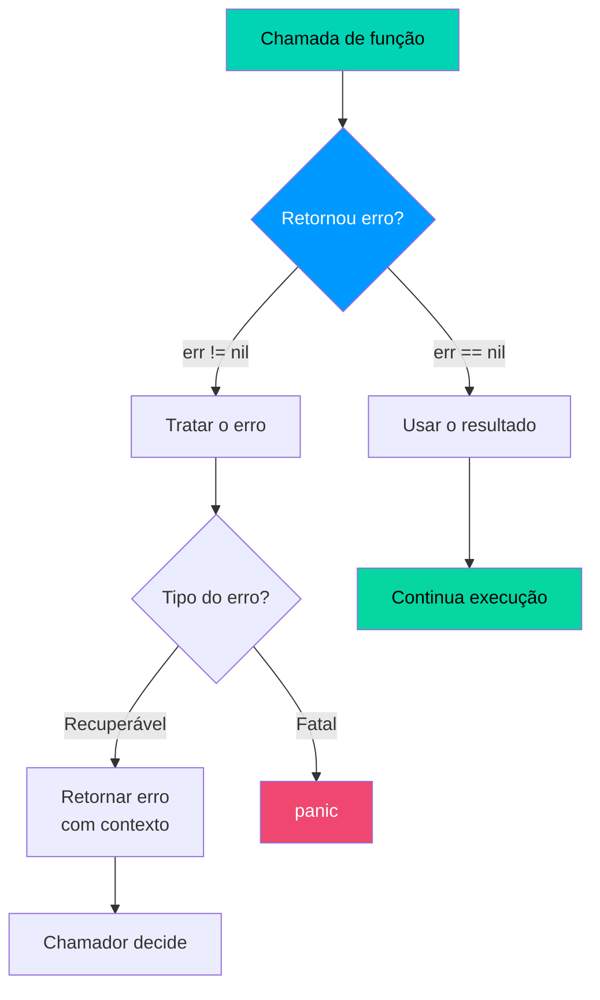
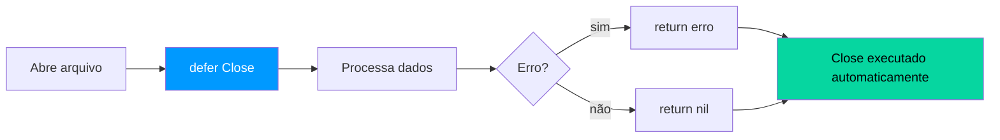

# ⚠️ Tratamento de Erros

Em Go, **erros são valores** — não exceções. Não existe `try/catch`. Funções retornam o erro como último valor e o chamador verifica explicitamente.

---

## Fluxo de Tratamento de Erros



---

## Padrão Básico

```go 
func dividir(a, b float64) (float64, error) { // (1)!
    if b == 0 {
        return 0, errors.New("divisão por zero") // (2)!
    }
    return a / b, nil // (3)!
}

resultado, err := dividir(10, 2) // (4)!
if err != nil { // (5)!
    fmt.Println("Erro:", err)
    return
}
fmt.Println(resultado) // 5
```

1. 📤 Convenção Go: `error` é sempre o **último valor de retorno**.
2. ❌ `errors.New` cria um erro simples com mensagem de texto.
3. ✅ `nil` representa **ausência de erro** — retorne sempre que der certo.
4. 📥 Dois valores de retorno: resultado e possível erro.
5. 🔍 **Sempre verifique** `err != nil` antes de usar o resultado.

!!! info "Interface error"
    O tipo `error` é uma **interface nativa** do Go:
    ```go
    type error interface {
        Error() string
    }
    ```
    Qualquer tipo que implemente `Error() string` satisfaz a interface.

---

## Erros com Contexto — `fmt.Errorf`

```go 
erroOriginal := errors.New("conexão recusada")

erroContexto := fmt.Errorf("falha ao conectar ao banco: %w", erroOriginal) // (1)!

if errors.Is(erroContexto, erroOriginal) { // (2)!
    fmt.Println("É um erro de conexão!")
}

fmt.Println(erroContexto)
// falha ao conectar ao banco: conexão recusada
```

1. 📦 O verbo `%w` **envolve (wraps)** o erro original preservando a cadeia.
2. 🔍 `errors.Is` verifica se um erro **contém** o erro alvo na cadeia.

!!! tip "Dica — Sempre adicione contexto"
    Ao propagar erros, adicione contexto com `fmt.Errorf`:
    ```go
    return fmt.Errorf("ao processar pedido %d: %w", id, err)
    ```
    Isso cria uma trilha clara de onde o erro originou.

---

## Erros Customizados

```go 
type ErroValidacao struct { // (1)!
    Campo    string
    Mensagem string
}

func (e *ErroValidacao) Error() string { // (2)!
    return fmt.Sprintf("campo '%s': %s", e.Campo, e.Mensagem)
}

func validarIdade(idade int) error {
    if idade < 0 {
        return &ErroValidacao{Campo: "idade", Mensagem: "não pode ser negativa"} // (3)!
    }
    return nil
}

var valErr *ErroValidacao
if errors.As(err, &valErr) { // (4)!
    fmt.Println("Campo com problema:", valErr.Campo)
}
```

1. 🏗️ Struct customizada que vai representar o erro com campos extras.
2. 🔤 Implementa a interface `error` definindo o método `Error() string`.
3. 📤 Retorna um ponteiro para o erro customizado.
4. 🎯 `errors.As` extrai o erro de um **tipo específico** na cadeia.

---

## `defer` — Garantindo Limpeza



```go 
func processarArquivo(nome string) error {
    arquivo, err := os.Open(nome)
    if err != nil {
        return fmt.Errorf("ao abrir: %w", err)
    }
    defer arquivo.Close() // (1)!

    // ... processamento ...
    return nil
}

func exemplo() {
    defer fmt.Println("terceiro") // (2)!
    defer fmt.Println("segundo")
    defer fmt.Println("primeiro")
    fmt.Println("executando...")
}
// executando... → primeiro → segundo → terceiro
```

1. 🔒 `defer` garante que `Close()` será chamado **quando a função retornar**, mesmo em caso de erro.
2. 📚 Múltiplos `defer` executam em ordem **LIFO** (último a entrar, primeiro a sair).

!!! warning "Atenção — panic vs error"
    Não use `panic` para erros esperados. Use a tabela abaixo para decidir:

    | Situação | Use |
    |----------|-----|
    | Erro esperado e recuperável | Retorne `error` |
    | Bug no código (impossível) | `panic` |
    | Liberar recursos | `defer` |
    | Recuperar de panic em servidor | `recover` em `defer` |

!!! danger "Cuidado — panic em produção"
    Um `panic` não recuperado **derruba o programa inteiro**. Em servidores HTTP, sempre use `recover` em um middleware para capturar panics e retornar HTTP 500 ao cliente, evitando derrubar o servidor.
