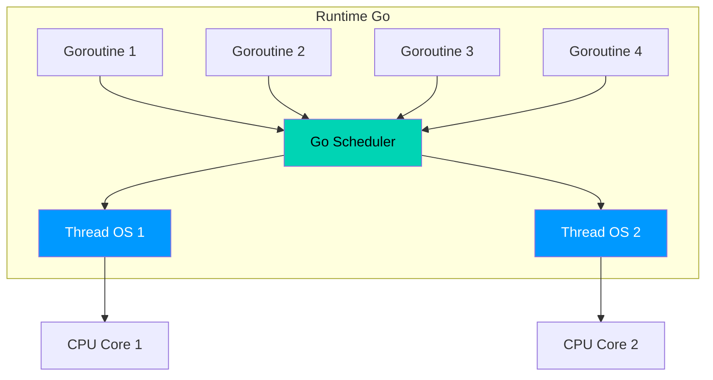
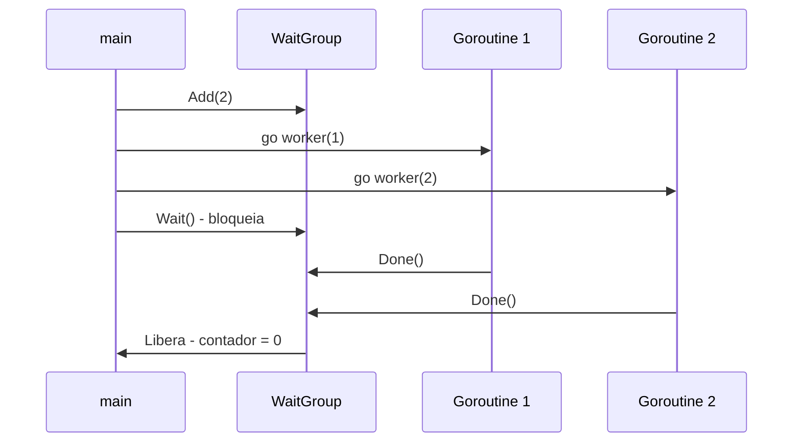

# ⚡ Concorrência I: Goroutines

Goroutines são **threads ultra-leves** gerenciadas pelo runtime do Go. Começam com ~2KB de stack e você pode ter milhares rodando simultaneamente.

---

## O que é uma Goroutine?

Uma goroutine é uma **thread leve gerenciada pelo runtime do Go**. Ao contrário das threads do sistema operacional (que consomem cerca de 1–2 MB de memória cada), uma goroutine começa com apenas **~2 KB de stack**, que cresce dinamicamente conforme necessário.

O Go scheduler (agendador) multiplexa N goroutines em M threads do SO — esse modelo é chamado de **M:N scheduling**.

## Go Scheduler — M:N Threading



| Aspecto | Thread do SO | Goroutine |
|---------|-------------|-----------|
| Memória inicial | ~1–2 MB | ~2 KB |
| Criação | Cara (syscall) | Muito barata |
| Troca de contexto | Cara | Muito barata |
| Gerenciamento | SO | Runtime Go |
| Quantidade típica | Centenas | Milhares+ |

---

## Criando Goroutines

```go 
func saudar(nome string) {
    fmt.Printf("Olá, %s!\n", nome)
}

func main() {
    go saudar("Alice") // (1)!
    go saudar("Bob")
    go saudar("Carol")

    time.Sleep(100 * time.Millisecond) // (2)!
}
```

1. 🚀 A keyword `go` antes de qualquer chamada de função a executa em uma **nova goroutine**.
2. ⏱️ `time.Sleep` é usado aqui apenas para fins **didáticos** — nunca use para sincronização real.

!!! warning "Atenção — time.Sleep não é sincronização"
    Usar `time.Sleep` para aguardar goroutines é **impreciso e não confiável**. Use `sync.WaitGroup` ou channels para sincronização correta.

---

## `sync.WaitGroup`



```go 
var wg sync.WaitGroup // (1)!

for i := 1; i <= 5; i++ {
    wg.Add(1) // (2)!
    go func(id int) {
        defer wg.Done() // (3)!
        fmt.Printf("Worker %d concluído\n", id)
    }(i) // (4)!
}

wg.Wait() // (5)!
fmt.Println("Todos os workers concluídos!")
```

1. 📦 `WaitGroup` mantém um **contador** interno de goroutines ativas.
2. ➕ `Add(1)` incrementa o contador — chame **antes** de iniciar a goroutine.
3. ➖ `Done()` decrementa o contador — use com `defer` para garantir execução.
4. 🔒 Passe `i` como argumento para evitar **closure bug** (capturar variável do loop).
5. 🛑 `Wait()` bloqueia até o contador chegar a **zero**.

!!! danger "Cuidado — Race Condition"
    Múltiplas goroutines acessando a mesma variável sem sincronização causam **comportamento imprevisível**:
    ```go
    // ❌ RACE CONDITION
    var contador int
    for i := 0; i < 1000; i++ {
        go func() { contador++ }() // leitura + escrita não atômica!
    }
    ```
    Execute `go run -race main.go` para detectar race conditions automaticamente.

---

## `sync.Mutex` — Exclusão Mútua

```go 
type ContadorSeguro struct {
    mu    sync.Mutex // (1)!
    valor int
}

func (c *ContadorSeguro) Incrementar() {
    c.mu.Lock()         // (2)!
    defer c.mu.Unlock() // (3)!
    c.valor++
}

func (c *ContadorSeguro) Valor() int {
    c.mu.Lock()
    defer c.mu.Unlock()
    return c.valor
}
```

1. 🔒 `sync.Mutex` garante que apenas **uma goroutine por vez** acessa a seção crítica.
2. 🔐 `Lock()` — adquire o lock. Outras goroutines **bloqueiam** aqui se já estiver locked.
3. 🔓 `Unlock()` com `defer` — garante que o lock **sempre** será liberado ao sair da função.

!!! tip "Dica — RWMutex para mais performance"
    Quando há muito mais **leituras** do que escritas, use `sync.RWMutex`:
    ```go
    mu.RLock()   // múltiplos leitores simultâneos ✅
    mu.RUnlock()
    mu.Lock()    // apenas um escritor por vez
    mu.Unlock()
    ```

---

## Closure Bug — Armadilha Clássica

```go 
// ❌ BUG — todas capturam o mesmo i
for i := 0; i < 5; i++ {
    go func() {
        fmt.Println(i) // (1)!
    }()
}

// ✅ CORRETO — passa i como argumento
for i := 0; i < 5; i++ {
    go func(n int) { // (2)!
        fmt.Println(n)
    }(i)
}
```

1. ⚠️ A closure captura a **variável `i`**, não o valor. Quando a goroutine executa, `i` pode já ser 5.
2. ✅ Passar como argumento cria uma **cópia independente** do valor para cada goroutine.

!!! warning "Atenção — Goroutine Leak"
    Uma goroutine que **nunca termina** (bloqueada para sempre) é um goroutine leak. Isso consome memória progressivamente. Use sempre `context` ou `channel` de cancelamento para sinalizar término.
