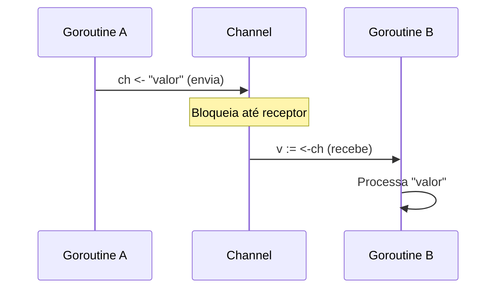
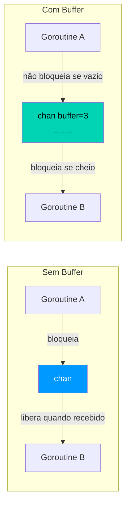
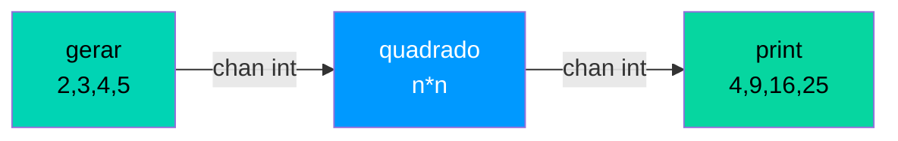

# 🔗 Concorrência II: Channels

> *"Não comunique compartilhando memória; compartilhe memória comunicando."*

Channels são **tubos tipados** por onde goroutines trocam dados com segurança.

---

## Como Channels Funcionam



---

## Criando e Usando Channels

```go 
ch := make(chan string) // (1)!

go func() {
    ch <- "Olá do canal!" // (2)!
}()

mensagem := <-ch // (3)!
fmt.Println(mensagem)
```

1. 📦 `make(chan Tipo)` cria um channel **sem buffer** (síncrono).
2. 📤 `ch <- valor` **envia** um valor. Bloqueia até haver um receptor.
3. 📥 `<-ch` **recebe** um valor. Bloqueia até haver um valor disponível.

---

## Channel com Buffer vs Sem Buffer



```go 
// Sem buffer — síncrono
ch1 := make(chan int) // (1)!

// Com buffer de 3
ch2 := make(chan int, 3) // (2)!
ch2 <- 1  // não bloqueia
ch2 <- 2  // não bloqueia
ch2 <- 3  // não bloqueia
// ch2 <- 4  ← bloquearia! (3)!

fmt.Println(<-ch2) // 1
```

1. 🔄 **Sem buffer** — envio e recebimento devem estar prontos ao mesmo tempo.
2. 📦 **Com buffer** — aceita até 3 valores sem um receptor imediato.
3. 🛑 O 4º envio bloquearia pois o buffer estaria cheio.

!!! warning "Atenção — Fechar channels"
    Apenas o **produtor** (quem envia) deve fechar um channel. Enviar para um channel fechado causa **panic**.
    ```go
    close(ch)        // ✅ feche apenas no produtor
    ch <- valor      // ❌ PANIC se ch já estiver fechado
    ```

---

## Direção de Channels

```go 
func produtor(ch chan<- int) { // (1)!
    for i := 0; i < 5; i++ {
        ch <- i
    }
    close(ch)
}

func consumidor(ch <-chan int) { // (2)!
    for v := range ch { // (3)!
        fmt.Println("Recebido:", v)
    }
}

func main() {
    ch := make(chan int)
    go produtor(ch)
    consumidor(ch)
}
```

1. 📤 `chan<-` — channel **somente envio**. O compilador impede leituras.
2. 📥 `<-chan` — channel **somente recebimento**. O compilador impede envios.
3. 🔄 `for range` em channel lê valores até o channel ser **fechado**.

!!! tip "Dica — Restrinja a direção"
    Restringir a direção de channels em parâmetros de funções documenta a intenção e evita bugs detectados em **tempo de compilação**.

---

## `select` — Multiplexando Channels

```go
ch1 := make(chan string)
ch2 := make(chan string)

select { // (1)!
case msg := <-ch1: // (2)!
    fmt.Println("Canal 1:", msg)
case msg := <-ch2:
    fmt.Println("Canal 2:", msg)
case <-time.After(2 * time.Second): // (3)!
    fmt.Println("Timeout!")
default: // (4)!
    fmt.Println("Nenhum canal pronto")
}
```

1. 🎯 `select` aguarda o **primeiro channel que ficar pronto**.
2. 🎲 Se múltiplos channels estiverem prontos ao mesmo tempo, um é escolhido **aleatoriamente**.
3. ⏱️ `time.After` retorna um channel que envia após o tempo especificado — útil para timeout.
4. ⚡ `default` é executado **imediatamente** se nenhum channel estiver pronto (não bloqueante).

---

## Padrão Pipeline



```go 
func gerar(nums ...int) <-chan int { // (1)!
    out := make(chan int)
    go func() {
        for _, n := range nums { out <- n }
        close(out)
    }()
    return out
}

func quadrado(in <-chan int) <-chan int { // (2)!
    out := make(chan int)
    go func() {
        for n := range in { out <- n * n }
        close(out)
    }()
    return out
}

func main() {
    c := gerar(2, 3, 4, 5)
    out := quadrado(c) // (3)!
    for v := range out {
        fmt.Println(v) // 4, 9, 16, 25
    }
}
```

1. 🏭 Estágio **produtor** — gera valores e os envia para o channel.
2. ⚙️ Estágio **transformador** — lê, processa e envia para o próximo estágio.
3. 🔗 Os estágios são **encadeados** — a saída de um é a entrada do próximo.

!!! danger "Cuidado — Goroutine Leak em Pipelines"
    Se um consumidor parar de ler antes do produtor terminar, o produtor ficará **bloqueado para sempre**. Use `context.WithCancel` para sinalizar cancelamento em toda a cadeia do pipeline.

---

## Channels vs Mutex

| Situação | Use |
|----------|-----|
| Transferir dados entre goroutines | Channel |
| Sinalizar eventos / conclusão | Channel |
| Pipeline de processamento | Channel |
| Proteger estado compartilhado | Mutex |
| Operações atômicas em inteiros | `sync/atomic` |
| Inicialização única (singleton) | `sync.Once` |
