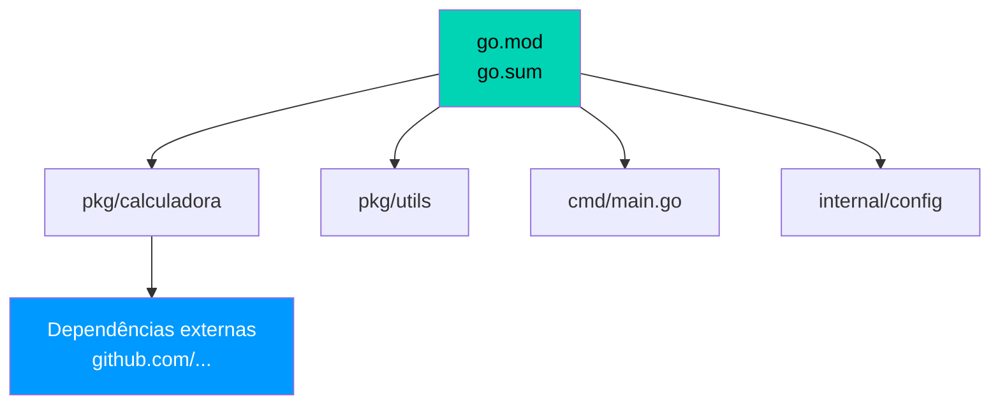
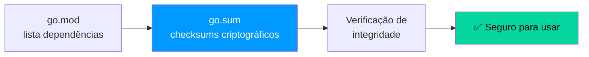
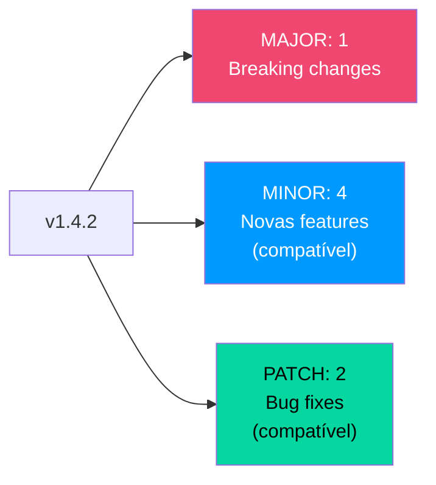

# 📦 Gerenciamento de Pacotes (Go Modules)

Go Modules é o sistema oficial de dependências desde o Go 1.16 — sem GOPATH, projetos em qualquer diretório, controle de versão semântico.

---

## Estrutura de um Módulo



---

## Criando um Módulo

```bash 
mkdir meu-projeto && cd meu-projeto # (1)!
go mod init github.com/usuario/meu-projeto # (2)!
```

1. 📁 Crie e entre na pasta do projeto.
2. 🚀 Inicializa o módulo com o **caminho do módulo** — geralmente a URL do repositório.

O arquivo `go.mod` gerado:

```go
module github.com/usuario/meu-projeto // (1)!

go 1.22 // (2)!
```

1. 📦 Caminho do módulo — identificador único usado nas importações.
2. 🔢 Versão mínima do Go exigida pelo módulo.

---

## Adicionando Dependências

```bash 
go get github.com/gin-gonic/gin        # (1)!
go get github.com/gin-gonic/gin@v1.9.1 # (2)!
go get github.com/gin-gonic/gin@none   # (3)!
go mod tidy                            # (4)!
```

1. ⬇️ Baixa a **versão mais recente** e adiciona ao `go.mod`.
2. 📌 Fixa em uma **versão específica**.
3. 🗑️ **Remove** a dependência do projeto.
4. 🧹 Sincroniza — remove não usadas e adiciona faltantes.

!!! tip "Dica — Sempre rode go mod tidy"
    Execute `go mod tidy` antes de todo commit para manter `go.mod` e `go.sum` sincronizados com o código real.

---

## O arquivo `go.sum`



!!! warning "Atenção — Nunca edite go.sum manualmente"
    O `go.sum` é gerado automaticamente e contém **checksums criptográficos** de cada módulo. Editá-lo manualmente corrompe a verificação de integridade. Sempre commite `go.sum` junto com `go.mod`.

---

## Comandos Principais

```bash 
go mod init   # (1)!
go mod tidy   # (2)!
go mod download # (3)!
go mod verify # (4)!
go mod vendor # (5)!
go list -m all # (6)!
```

1. 🆕 Cria um novo módulo.
2. 🔄 Sincroniza dependências com o código.
3. ⬇️ Baixa todas as dependências para o cache local.
4. 🔍 Verifica checksums das dependências.
5. 📦 Copia dependências para a pasta `vendor/`.
6. 📋 Lista todos os módulos do projeto.

---

## Versionamento Semântico (SemVer)



!!! info "Módulos v2+"
    Para versões com **breaking changes** (v2+), o caminho do módulo muda:
    ```go
    module github.com/usuario/lib/v2
    ```
    E nas importações:
    ```go
    import "github.com/usuario/lib/v2/pacote"
    ```

---

## Pacotes da Biblioteca Padrão

| Pacote | Uso |
|--------|-----|
| `fmt` | Formatação e I/O |
| `os` | Sistema operacional e arquivos |
| `strings` | Manipulação de strings |
| `strconv` | Conversão de tipos |
| `net/http` | Cliente e servidor HTTP |
| `encoding/json` | Serialização JSON |
| `sync` | Primitivas de sincronização |
| `context` | Contexto e cancelamento |
| `errors` | Criação e inspeção de erros |
| `testing` | Framework de testes |
| `time` | Data, hora e duração |
| `math/rand` | Números aleatórios |

!!! danger "Cuidado — replace em produção"
<<<<<<< HEAD
    A diretiva `replace` no `go.mod` é útil para desenvolvimento local, mas **nunca publique um módulo com `replace` apontando para caminhos locais**. Remova antes de fazer release.
=======
    A diretiva `replace` no `go.mod` é útil para desenvolvimento local, mas **nunca publique um módulo com `replace` apontando para caminhos locais**. Remova antes de fazer release.
>>>>>>> 1e1dff4238028d0d750af1eaf7679eae56b4fc9c
