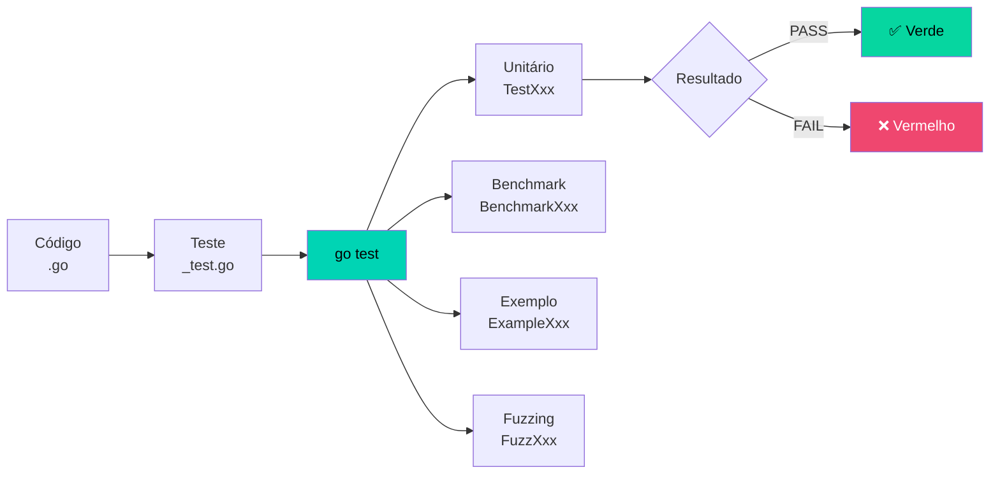
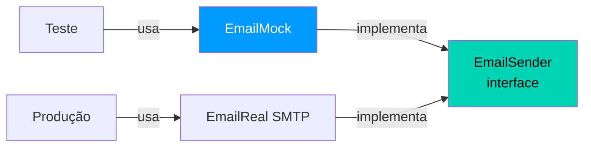

# ✅ Testes Automatizados em Go

Go tem suporte nativo a testes — sem frameworks externos. O pacote `testing` e o comando `go test` fazem tudo.

---

## Fluxo de Testes



---

## Estrutura Básica

```go 
// calculadora_test.go
package calculadora // (1)!

import "testing" // (2)!

func TestSomar(t *testing.T) { // (3)!
    resultado := Somar(2, 3)
    esperado := 5.0

    if resultado != esperado { // (4)!
        t.Errorf("Somar(2, 3) = %.1f; esperado %.1f",
            resultado, esperado)
    }
}
```

1. 📦 Mesmo pacote do código — acesso a funções não exportadas.
2. 📋 Único import necessário — não precisa de framework externo.
3. 🧪 Nome **obrigatoriamente** começa com `Test` e recebe `*testing.T`.
4. 🔍 Verificação manual — Go não tem `assert` nativo por design.

```bash 
go test ./...           # (1)!
go test -v ./...        # (2)!
go test -run TestSomar  # (3)!
go test -cover ./...    # (4)!
go test -race ./...     # (5)!
```

1. 🔍 Executa todos os testes do projeto recursivamente.
2. 📢 Modo **verbose** — exibe o nome de cada teste executado.
3. 🎯 Executa apenas testes que correspondem ao padrão (regex).
4. 📊 Exibe o **percentual de cobertura** de código.
5. 🔒 Detecta **race conditions** — sempre use no CI/CD.

---

## Table-Driven Tests — O Padrão Go

```go 
func TestDividir(t *testing.T) {
    casos := []struct { // (1)!
        nome     string
        a, b     float64
        esperado float64
        erro     bool
    }{
        {"simples",    10, 2,  5,    false},
        {"decimal",    7,  2,  3.5,  false},
        {"por zero",   5,  0,  0,    true},
        {"negativos", -10, 2, -5,   false},
    }

    for _, tc := range casos {
        t.Run(tc.nome, func(t *testing.T) { // (2)!
            resultado, err := Dividir(tc.a, tc.b)

            if tc.erro && err == nil { // (3)!
                t.Error("esperava erro, mas não houve")
                return
            }
            if !tc.erro && resultado != tc.esperado {
                t.Errorf("got %v; want %v", resultado, tc.esperado)
            }
        })
    }
}
```

1. 📊 **Slice de structs anônimas** — cada elemento é um caso de teste.
2. 🏷️ `t.Run` cria **subtestes nomeados** — falhas indicam exatamente qual caso falhou.
3. ✅ Teste do caminho de erro — verifica que erros esperados realmente ocorrem.

!!! tip "Dica — Por que Table-Driven?"
    É o padrão idiomático Go porque:
    
    - Fácil de **adicionar novos casos** sem duplicar código
    - Cada caso tem um **nome descritivo** nos relatórios
    - Falhas indicam **exatamente qual cenário** quebrou

---

## Benchmarks

```go 
func BenchmarkSomar(b *testing.B) { // (1)!
    for i := 0; i < b.N; i++ { // (2)!
        Somar(10, 20)
    }
}
```

1. 🏎️ Nome começa com `Benchmark` e recebe `*testing.B`.
2. 🔢 `b.N` é ajustado **automaticamente** pelo framework para medições confiáveis.

```bash
go test -bench=. -benchmem ./...
```

**Exemplo de saída:**
```
BenchmarkSomar-8    1000000000    0.25 ns/op    0 B/op    0 allocs/op
```

---

## Testando com Mocks via Interfaces



```go 
type EmailSender interface { // (1)!
    Enviar(para, assunto, corpo string) error
}

type emailMock struct { // (2)!
    ultimoPara string
}

func (m *emailMock) Enviar(para, assunto, corpo string) error {
    m.ultimoPara = para
    return nil
}

func TestNotificar(t *testing.T) {
    mock := &emailMock{} // (3)!
    notif := &Notificador{email: mock}

    notif.NotificarUsuario("alice", "Bem-vinda!")

    if mock.ultimoPara != "alice@empresa.com" { // (4)!
        t.Errorf("email enviado para %q; esperado alice@empresa.com", mock.ultimoPara)
    }
}
```

1. 📋 Interface define o contrato — separa implementação real do mock.
2. 🃏 **Mock** implementa a interface mas não envia email de verdade.
3. 🔌 Injeta o mock via **injeção de dependência**.
4. ✅ Verifica o comportamento sem depender de servidor SMTP real.

!!! warning "Atenção — Cobertura não é tudo"
    100% de cobertura **não garante** ausência de bugs. Foque em:
    
    - Cobrir todos os **caminhos de erro**
    - Testar **edge cases** (valores limite, strings vazias, nil)
    - Usar `-race` no CI para detectar race conditions

!!! danger "Cuidado — Testes frágeis"
    Evite testar **detalhes de implementação internos**. Teste apenas o **comportamento observável** (entradas e saídas). Testes acoplados à implementação quebram a cada refatoração, mesmo quando o comportamento continua correto.
