# 📦 Arrays, Slices e Maps

Go oferece três estruturas de dados fundamentais: **arrays** (fixos), **slices** (dinâmicos) e **maps** (chave-valor).

---

## Comparação Visual

```mermaid
graph TD
    subgraph Array
        A1[0: maçã] --- A2[1: banana] --- A3[2: laranja]
    end
    subgraph Slice
        S1[ptr →] --> A1
        S2[len: 2]
        S3[cap: 3]
    end
    subgraph Map
        M1[Brasil → Brasília]
        M2[Chile → Santiago]
        M3[Peru → Lima]
    end

    style Array fill:#1a1d2b,stroke:#00d4b4
    style Slice fill:#1a1d2b,stroke:#0099ff
    style Map fill:#1a1d2b,stroke:#06d6a0
```



---

## Arrays

```go 
// Declaração com zero values (todos os elementos são 0)
var numeros [5]int // (1)!
primos := [5]int{2, 3, 5, 7, 11} // (2)!
vogais := [...]string{"a", "e", "i", "o", "u"} // (3)!

fmt.Println(primos[0])   // 2
fmt.Println(len(vogais)) // 5
```

1. 📦 Array de 5 inteiros com **zero values** (`[0 0 0 0 0]`).
2. ✍️ Array inicializado com valores literais.
3. 🔢 O `...` faz o Go **contar automaticamente** o tamanho.

!!! warning "Atenção — Arrays são copiados por valor"
    Ao atribuir um array a outra variável ou passar para uma função, **toda a memória é copiada**. Para trabalhar com referências, use slices.

---

## Slices

### Anatomia de um Slice

```mermaid
graph LR
    subgraph Slice
        P[Pointer] --> AR
        L[Length: 3]
        C[Capacity: 5]
    end
    subgraph Array interno
        AR["maçã, banana, laranja, _, _"]
    end

    style Slice fill:#1a1d2b,stroke:#0099ff
    style Array interno fill:#1a1d2b,stroke:#00d4b4
```



```go 
frutas := []string{"maçã", "banana", "laranja"} // (1)!

frutas = append(frutas, "uva")       // (2)!
frutas = append(frutas, "pera", "kiwi")

fmt.Println(frutas[1:3])  // [banana laranja] (3)!
fmt.Println(frutas[:2])   // [maçã banana]
fmt.Println(len(frutas))  // 5 (4)!
fmt.Println(cap(frutas))  // capacidade atual
```

1. 📋 Slice literal — sem tamanho fixo entre colchetes.
2. ➕ `append` adiciona elementos — **sempre reatribua** o resultado.
3. ✂️ Fatiamento `[inicio:fim]` — `fim` é **exclusivo**.
4. 📏 `len` retorna o número de elementos; `cap` retorna a capacidade.

!!! danger "Cuidado — append e realocação"
    Quando a capacidade é excedida, Go cria um **novo array interno com o dobro da capacidade** e copia os dados. Por isso nunca esqueça de reatribuir:
    ```go
    s = append(s, novoValor) // ✅ correto
    append(s, novoValor)     // ❌ resultado ignorado!
    ```

### Deletando elementos

```go 
s := []int{1, 2, 3, 4, 5}
i := 2 // índice a remover

s = append(s[:i], s[i+1:]...) // (1)!
fmt.Println(s) // [1 2 4 5]
```

1. 🗑️ Não existe `remove` nativo — o idioma Go é concatenar as fatias antes e depois do índice.

!!! tip "Dica — Slice 2D (Matriz)"
    ```go
    matriz := [][]int{
        {1, 2, 3},
        {4, 5, 6},
        {7, 8, 9},
    }
    fmt.Println(matriz[1][2]) // 6
    ```

---

## Maps

```go 
capitais := map[string]string{ // (1)!
    "Brasil":    "Brasília",
    "Argentina": "Buenos Aires",
    "Chile":     "Santiago",
}

fmt.Println(capitais["Brasil"]) // Brasília

valor, ok := capitais["Portugal"] // (2)!
if !ok {
    fmt.Println("País não encontrado")
}

capitais["Uruguai"] = "Montevidéu" // (3)!
delete(capitais, "Chile")           // (4)!
```

1. 🗂️ Map literal com chave `string` e valor `string`.
2. ✅ Sempre use **dois valores de retorno** para verificar se a chave existe.
3. ➕ Inserir ou atualizar — mesma sintaxe.
4. 🗑️ `delete` remove um par chave-valor do map.

!!! warning "Atenção — Map nil"
    Um map declarado com `var` sem inicialização é `nil`. Escrever em um map `nil` causa **panic**:
    ```go
    var m map[string]int  // nil!
    m["chave"] = 1        // ❌ PANIC: assignment to entry in nil map
    m = make(map[string]int) // ✅ inicialize antes de usar
    ```

!!! warning "Atenção — Ordem de iteração aleatória"
    A ordem de iteração em um map é **aleatória** a cada execução. Nunca dependa de uma ordem específica ao usar `for range` em maps.

---

## Comparação Final

| Característica | Array | Slice | Map |
|---------------|-------|-------|-----|
| Tamanho | Fixo | Dinâmico | Dinâmico |
| Tipo de chave | Índice (int) | Índice (int) | Qualquer comparável |
| Zero value | `[N]T{}` | `nil` | `nil` |
| Cópia por valor? | ✅ Sim | ❌ Não | ❌ Não |
| Ordenado? | ✅ Sim | ✅ Sim | ❌ Não |
