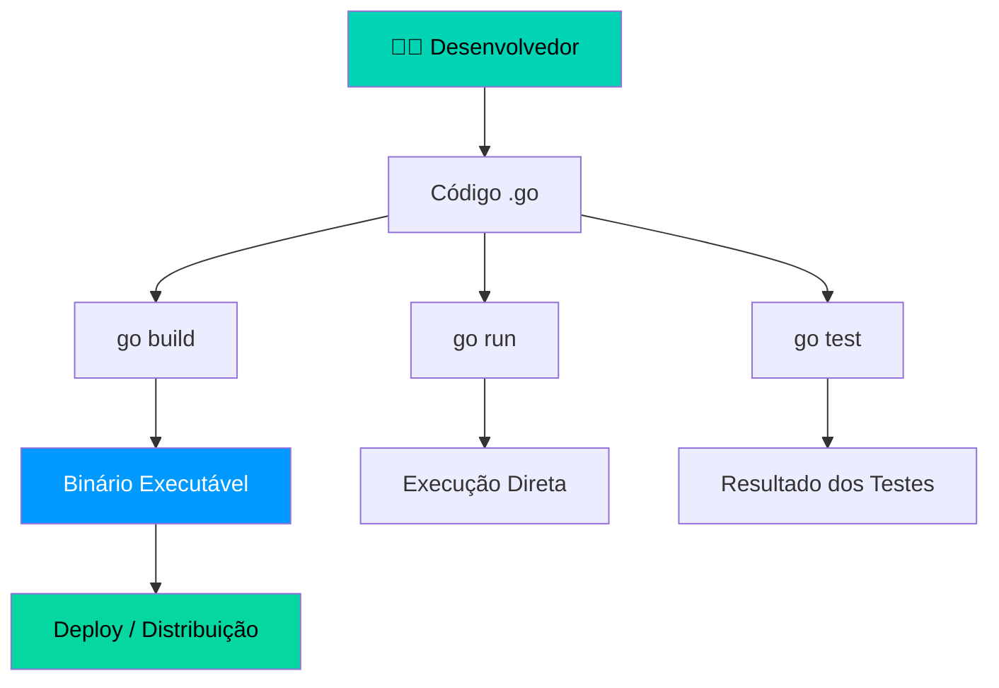

# 🚀 Introdução e Instalação

Go (também conhecida como **Golang**) é uma linguagem de programação open-source desenvolvida pelo Google em 2007. Projetada para ser simples, eficiente e escalável para sistemas modernos.

---

## Ecossistema Go



---

## Por que aprender Go?

| Área | Exemplos de uso |
|------|----------------|
| Back-end e APIs | Servidores HTTP, REST APIs, gRPC |
| DevOps e CLIs | Docker, Kubernetes, Terraform |
| Sistemas distribuídos | Microserviços, mensageria |
| Cloud | AWS Lambda, Google Cloud |

---

## Instalando o Go

=== "Linux"
    ```bash
    wget https://go.dev/dl/go1.22.0.linux-amd64.tar.gz
    sudo rm -rf /usr/local/go
    sudo tar -C /usr/local -xzf go1.22.0.linux-amd64.tar.gz
    echo 'export PATH=$PATH:/usr/local/go/bin' >> ~/.bashrc
    source ~/.bashrc
    go version
    ```

=== "macOS"
    ```bash
    brew install go
    go version
    ```

=== "Windows"
    ```bash
    # Baixe o instalador .msi em https://go.dev/dl/
    # Execute e siga os passos. Depois:
    go version
    ```

!!! info "Versão mínima"
    A versão mínima recomendada é **Go 1.20**. Sempre use a versão mais recente disponível em [go.dev/dl](https://go.dev/dl).

---

## Hello, World!

```go 
package main // (1)!

import "fmt" // (2)!

func main() {
    fmt.Println("Olá!") // (3)!
}
```

1. 📦 Todo arquivo Go pertence a um **pacote**. O pacote `main` é o ponto de entrada do programa.
2. 🔗 Importa o pacote `fmt` da biblioteca padrão — responsável por entrada e saída formatada.
3. 🚀 A função `main()` é obrigatória no pacote `main` — é onde a execução começa.
4. 🖨️ `Println` imprime o texto seguido de uma quebra de linha automática.

!!! tip "Dica — Go Playground"
    Teste código Go diretamente no navegador sem instalar nada: [go.dev/play](https://go.dev/play) 🎮

---

## Ferramentas Essenciais

| Comando | Descrição |
|---------|-----------|
| `go run` | Compila e executa diretamente |
| `go build` | Gera um binário executável |
| `go test` | Executa os testes |
| `go fmt` | Formata o código automaticamente |
| `go vet` | Analisa o código em busca de erros |
| `go mod init` | Inicializa um novo módulo |

!!! warning "Atenção — Variáveis de Ambiente"
    Verifique se o Go está no PATH após a instalação. Se o comando `go version` não for reconhecido, reinicie o terminal ou adicione manualmente ao PATH do sistema.

!!! danger "Cuidado — Versões Antigas"
    Não use versões anteriores ao Go 1.18 — elas não possuem suporte a **Generics** e **Fuzzing**, recursos importantes para projetos modernos.
